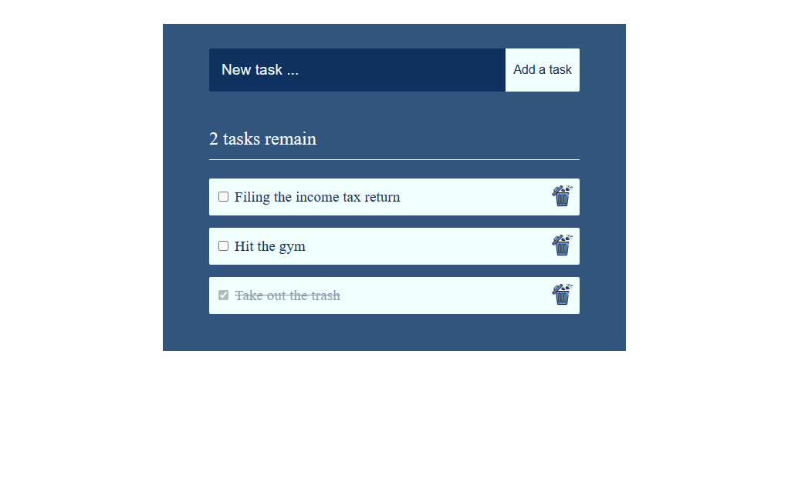

# ToDoList

## Aperçu du projet

## Présentation

Réalisation d'une to do list codé avec REACT.

Avec cette application il est possible de gérer une liste de tâches à faire.
On peut venir créer et supprimer une activité. Il est possible de valider une tâche sans la supprimer.

Lien vers l'application : https://cyrilclavaud90.github.io/ToDoList/
